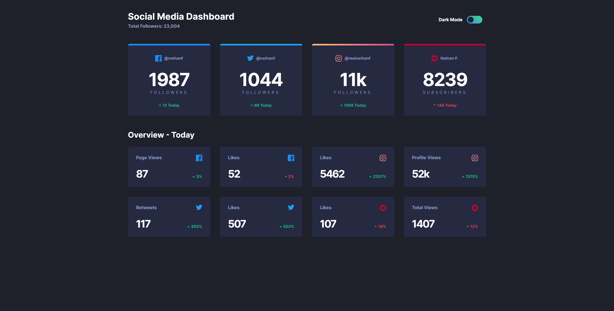

# Frontend Mentor - Social media dashboard with theme switcher solution

This is a solution to the [Social media dashboard with theme switcher challenge on Frontend Mentor](https://www.frontendmentor.io/challenges/social-media-dashboard-with-theme-switcher-6oY8ozp_H). Frontend Mentor challenges help you improve your coding skills by building realistic projects.

## Table of contents

- [Overview](#overview)
  - [The challenge](#the-challenge)
  - [Screenshot](#screenshot)
  - [Links](#links)
- [My process](#my-process)
  - [Built with](#built-with)
  - [What I learned](#what-i-learned)

## Overview

### The challenge

Users should be able to:

- View the optimal layout for the site depending on their device's screen size
- See hover states for all interactive elements on the page
- Toggle color theme to their preference

### Screenshot



### Links

- Solution URL: [Add solution URL here](https://github.com/majaton44/fem-dklt-toggle)
- Live Site URL: [Add live site URL here](https://your-live-site-url.com)

## My process

### Built with

- Semantic HTML5 markup
- CSS custom properties
- SASS
- Flexbox
- CSS Grid

### What I learned

```html
<!-- Light and Dark toggle -->
<fieldset
  class="header__toggle toggle"
  aria-label="theme toggle"
  role="radiogroup"
>
  <label for="dark">Dark Mode <span class="visually-hidden">On</span></label>
  <div class="toggle__wrapper">
    <input type="radio" name="theme" id="dark" />
    <input type="radio" name="theme" id="light" />
    <span aria-hidden="true" class="toggle__background"></span>
    <span aria-hidden="true" class="toggle__button"></span>
  </div>

  <label for="light" class="visually-hidden">Dark Mode Off</label>
</fieldset>
```

```scss
////////////////////////////////////////////////
// Function that converts pixels in rems
@function rem($pixels, $context: 16) {
  @return (math.div($pixels, $context)) * 1rem;
}

////////////////////////////////////////////////
// Using breakpoints for responsive design
$breakpoints-up: (
  "medium": "40em",
  "large": "71.875em",
  "xlarge": "87.5em",
);

$breakpoints-down: (
  "small": "39.9375em",
  "medium": "71.8125em",
  "large": "87.4375em",
);

@mixin breakpoint($size) {
  @media (min-width: map-get($breakpoints-up, $size)) {
    @content;
  }
}

@mixin breakpoint-down($size) {
  @media (max-width: map-get($breakpoints-down, $size)) {
    @content;
  }
}

.container {
  padding: 0 rem(25);
  max-width: rem(1110);
  margin: 0 auto rem(46);

  @include breakpoint(large) {
    padding: 0;
  }
}
```
